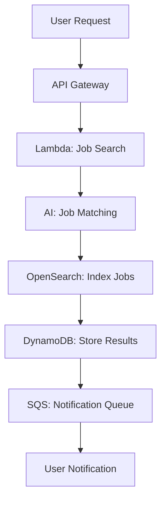
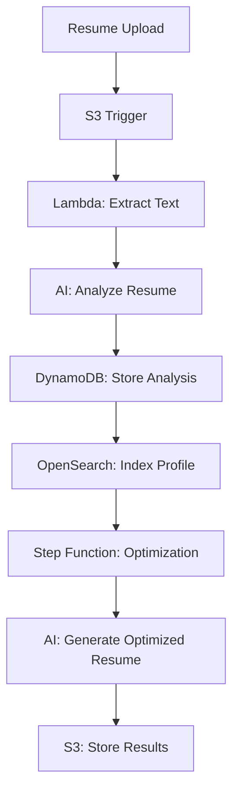

# 🚀 AI Career Agent - Enhanced Production Architecture

A comprehensive serverless AI-powered career management platform with enterprise-grade features including authentication, AI integration, powerful search, workflow orchestration, and advanced monitoring.

## 🏗️ Architecture Overview

This enhanced architecture implements all the powerful features you requested:

### 1. 🔐 **Authentication & Authorization**

- **Amazon Cognito User Pool** - Secure user authentication with JWT tokens
- **Cognito Identity Pool** - Federated identity management
- **API Gateway Authorizers** - Protect all API endpoints
- **IAM Roles** - Least privilege access control

### 2. 🤖 **AI Integration (Amazon Bedrock)**

- **Claude 3 Sonnet** - Advanced AI for job matching and resume optimization
- **Intelligent Job Matching** - AI-powered compatibility scoring
- **Resume Optimization** - ATS-compatible resume tailoring
- **Market Intelligence** - AI-driven career insights and predictions

### 3. 🔍 **Powerful Search (Amazon OpenSearch)**

- **Full-text Search** - Search jobs by skills, location, salary, company
- **Advanced Filtering** - Complex queries with multiple criteria
- **Real-time Indexing** - Automatic job data indexing via DynamoDB Streams
- **Analytics Dashboard** - Search analytics and user behavior insights

### 4. 🔄 **Workflow Orchestration (AWS Step Functions)**

- **Job Application Workflow** - Multi-step automated job application process
- **Error Handling** - Robust retry logic and error recovery
- **Visual Monitoring** - Step-by-step execution tracking
- **Parallel Processing** - Concurrent job searches and optimizations

### 5. 💪 **Resilience & Monitoring**

- **Dead Letter Queues** - Handle failed messages gracefully
- **AWS X-Ray Tracing** - End-to-end request tracing and debugging
- **CloudWatch Monitoring** - Comprehensive metrics and alerting
- **Auto-scaling** - Serverless components scale automatically

### 6. 📊 **Advanced Data Management**

- **DynamoDB Streams** - Real-time data change processing
- **S3 Event Triggers** - Automatic resume processing on upload
- **Data Encryption** - Encryption at rest and in transit
- **Backup & Recovery** - Point-in-time recovery enabled

## 🚀 Quick Start

### Prerequisites

- AWS CLI configured with appropriate permissions
- PowerShell (for Windows deployment script)
- Python 3.11+ (for testing)

### 1. Deploy the Architecture

```powershell
# Navigate to deployment directory
cd deployment

# Deploy with PowerShell script
.\deploy_enhanced_architecture.ps1 -Environment prod -Region us-east-1

# Or deploy manually with AWS CLI
aws cloudformation deploy \
  --template-file enhanced_production_template.yaml \
  --stack-name ai-career-agent-enhanced-prod \
  --parameter-overrides ProjectName=ai-career-agent Environment=prod \
  --capabilities CAPABILITY_NAMED_IAM \
  --region us-east-1
```

### 2. Test the Deployment

```bash
# Install test dependencies
pip install boto3 requests aiohttp

# Run comprehensive tests
python test_enhanced_architecture.py --stack-name ai-career-agent-enhanced-prod --region us-east-1
```

### 3. Configure Your Application

After deployment, you'll get these key outputs:

- **API Gateway Endpoint** - Your main API URL
- **Cognito User Pool ID** - For user authentication
- **Cognito Client ID** - For application integration
- **S3 Bucket Name** - For document storage
- **OpenSearch Endpoint** - For search functionality

## 🔧 Component Details

### Lambda Functions

#### 1. **Enhanced Job Search Agent** (`enhanced_job_search_agent.py`)

- **Multi-platform job search** across Indeed, LinkedIn, Glassdoor, Dice, Monster
- **AI-powered matching** with Claude 3 Sonnet for intelligent job scoring
- **OpenSearch indexing** for powerful search capabilities
- **Comprehensive analysis** including salary fit, culture match, career progression

**Key Features:**

- Real-time job discovery from multiple sources
- AI-driven compatibility scoring (0-100)
- Skill gap analysis and recommendations
- Market trend analysis and insights
- Automatic job indexing for search

#### 2. **Enhanced Resume Optimizer** (`enhanced_resume_optimizer.py`)

- **AI-powered optimization** tailored to specific job descriptions
- **ATS compatibility analysis** ensuring resume passes screening systems
- **Multi-format support** (PDF, DOCX, TXT)
- **Cover letter generation** customized for each application

**Key Features:**

- Job-specific resume tailoring
- ATS optimization scoring
- Professional cover letter generation
- Document format conversion
- Achievement quantification suggestions

#### 3. **Enhanced Market Intelligence** (`enhanced_market_intelligence.py`)

- **Real-time market analysis** with salary benchmarking
- **Career progression insights** and skill trend analysis
- **Geographic salary comparisons** and cost-of-living adjustments
- **Industry trend predictions** powered by AI

**Key Features:**

- Comprehensive salary analysis
- Skill demand forecasting
- Career path recommendations
- Market competitiveness assessment
- Negotiation strategy insights

### API Endpoints

#### Authentication Required Endpoints

```
POST /agent/jobs
- Search for jobs matching user profile
- Body: { "user_profile": {...}, "search_params": {...} }

POST /agent/resume
- Optimize resume for specific job
- Body: { "user_resume": "...", "job_description": "...", "job_title": "..." }

GET /agent/market?domain=Software&location=Remote&level=Mid
- Get market intelligence for job domain
```

#### Public Endpoints

```
GET /agent
- Health check and system status
```

### Database Schema

#### User Data Table

```json
{
  "userId": "user_12345",
  "email": "user@example.com",
  "profile": {
    "name": "John Doe",
    "experience_level": "Mid Level",
    "skills": ["Python", "AWS", "React"],
    "location": "San Francisco",
    "salary_expectation": 120000
  },
  "preferences": {
    "job_domains": ["Software Engineering"],
    "work_style": "Remote",
    "company_size_pref": "Medium"
  }
}
```

#### Job Search Table

```json
{
  "searchId": "search_20241019_143022_user123",
  "userId": "user_123",
  "timestamp": "2024-10-19T14:30:22Z",
  "results_summary": {
    "total_jobs_found": 25,
    "top_match_score": 95,
    "average_match_score": 78
  },
  "top_matches": [...],
  "ai_insights": {...}
}
```

### OpenSearch Index Structure

```json
{
  "job_id": "indeed_job_123",
  "title": "Senior Software Engineer",
  "company": "TechCorp",
  "location": "Remote",
  "salary_min": 120000,
  "salary_max": 160000,
  "tech_stack": ["Python", "AWS", "React"],
  "match_score": 95,
  "remote_friendly": true,
  "posted_date": "2024-10-19T10:00:00Z"
}
```

## 🔐 Security Features

### Authentication Flow

1. **User Registration** - Cognito User Pool with email verification
2. **Login** - JWT token generation with configurable expiration
3. **API Access** - Bearer token validation on all protected endpoints
4. **Session Management** - Automatic token refresh and logout

### Data Protection

- **Encryption at Rest** - All DynamoDB tables and S3 buckets encrypted
- **Encryption in Transit** - HTTPS/TLS for all API communications
- **IAM Roles** - Least privilege access for all services
- **VPC Integration** - Optional VPC deployment for network isolation

### Compliance Features

- **Audit Logging** - CloudTrail integration for all API calls
- **Data Retention** - Configurable TTL for personal data
- **GDPR Compliance** - User data export and deletion capabilities
- **SOC 2 Ready** - Security controls and monitoring in place

## 📊 Monitoring & Observability

### AWS X-Ray Integration

- **End-to-end tracing** of all requests through the system
- **Performance analysis** with detailed timing breakdowns
- **Error tracking** and root cause analysis
- **Service map visualization** showing component interactions

### CloudWatch Monitoring

- **Custom metrics** for job search success rates, AI response times
- **Automated alerts** for system errors and performance degradation
- **Dashboard views** for real-time system health monitoring
- **Log aggregation** from all Lambda functions and services

### Key Metrics Tracked

- API response times and error rates
- Job search success rates and match quality
- AI model invocation latency and costs
- User engagement and conversion metrics
- System resource utilization and costs

## 🔄 Workflow Examples

### Job Search Workflow



### Resume Optimization Workflow



## 💰 Cost Optimization

### Serverless Benefits

- **Pay-per-use** - Only pay for actual compute time and requests
- **Auto-scaling** - Automatically handles traffic spikes and quiet periods
- **No infrastructure management** - AWS handles all server provisioning and maintenance

### Cost Estimates (Monthly)

- **Light Usage** (100 users, 1000 requests): ~$50-100
- **Medium Usage** (1000 users, 10000 requests): ~$200-400
- **Heavy Usage** (10000 users, 100000 requests): ~$800-1500

### Cost Optimization Features

- **DynamoDB On-Demand** - Pay only for reads/writes used
- **Lambda Provisioned Concurrency** - Optional for consistent performance
- **S3 Intelligent Tiering** - Automatic cost optimization for storage
- **CloudWatch Log Retention** - Configurable retention periods

## 🚀 Deployment Environments

### Development Environment

```powershell
.\deploy_enhanced_architecture.ps1 -Environment dev -Region us-east-1
```

### Staging Environment

```powershell
.\deploy_enhanced_architecture.ps1 -Environment staging -Region us-east-1
```

### Production Environment

```powershell
.\deploy_enhanced_architecture.ps1 -Environment prod -Region us-east-1
```

## 🧪 Testing Strategy

### Unit Tests

- Individual Lambda function testing
- AI model response validation
- Database operation verification

### Integration Tests

- End-to-end API workflow testing
- Cross-service communication validation
- Authentication flow verification

### Performance Tests

- Load testing with concurrent users
- AI model response time optimization
- Database query performance tuning

### Security Tests

- Authentication bypass attempts
- Input validation and sanitization
- Data encryption verification

## 📈 Scaling Considerations

### Automatic Scaling

- **Lambda Concurrency** - Automatically scales to handle traffic
- **DynamoDB Auto-scaling** - Adjusts read/write capacity based on demand
- **API Gateway** - Handles millions of requests per second
- **OpenSearch** - Can scale nodes based on search volume

### Performance Optimization

- **Connection Pooling** - Reuse database connections in Lambda
- **Caching Strategy** - Redis/ElastiCache for frequently accessed data
- **CDN Integration** - CloudFront for static content delivery
- **Database Indexing** - Optimized queries with proper indexes

## 🔧 Troubleshooting

### Common Issues

#### 1. **Lambda Timeout Errors**

```bash
# Check function timeout settings
aws lambda get-function --function-name ai-career-agent-main-agent-prod

# Increase timeout if needed
aws lambda update-function-configuration \
  --function-name ai-career-agent-main-agent-prod \
  --timeout 300
```

#### 2. **Cognito Authentication Issues**

```bash
# Verify user pool configuration
aws cognito-idp describe-user-pool --user-pool-id us-east-1_XXXXXXXXX

# Check user pool client settings
aws cognito-idp describe-user-pool-client \
  --user-pool-id us-east-1_XXXXXXXXX \
  --client-id XXXXXXXXXXXXXXXXXXXXXXXXXX
```

#### 3. **OpenSearch Connection Issues**

```bash
# Check domain status
aws opensearch describe-domain --domain-name ai-career-agent-search-prod

# Verify access policies
aws opensearch describe-domain-config --domain-name ai-career-agent-search-prod
```

### Debugging Tools

#### CloudWatch Logs

```bash
# View Lambda function logs
aws logs describe-log-groups --log-group-name-prefix /aws/lambda/ai-career-agent

# Tail logs in real-time
aws logs tail /aws/lambda/ai-career-agent-main-agent-prod --follow
```

#### X-Ray Traces

```bash
# Get trace summaries
aws xray get-trace-summaries --time-range-type TimeRangeByStartTime \
  --start-time 2024-10-19T00:00:00Z --end-time 2024-10-19T23:59:59Z
```

## 🤝 Contributing

### Development Setup

1. Clone the repository
2. Install dependencies: `pip install -r lambda_functions/enhanced_requirements.txt`
3. Configure AWS credentials
4. Deploy to development environment
5. Run tests to verify functionality

### Code Standards

- **Python 3.11+** for all Lambda functions
- **Type hints** for better code documentation
- **Error handling** with proper logging
- **Security best practices** for all integrations

## 📚 Additional Resources

- [AWS Lambda Best Practices](https://docs.aws.amazon.com/lambda/latest/dg/best-practices.html)
- [Amazon Bedrock Documentation](https://docs.aws.amazon.com/bedrock/)
- [OpenSearch Service Guide](https://docs.aws.amazon.com/opensearch-service/)
- [Step Functions Developer Guide](https://docs.aws.amazon.com/step-functions/)
- [Cognito Developer Guide](https://docs.aws.amazon.com/cognito/)

## 🎯 Next Steps

1. **Deploy the architecture** using the provided scripts
2. **Run the test suite** to verify all components
3. **Configure your Streamlit app** to use the new endpoints
4. **Create test users** in Cognito for authentication
5. **Upload sample resumes** to test the optimization features
6. **Monitor performance** using CloudWatch and X-Ray
7. **Scale as needed** based on user adoption

---

🚀 **Your AI Career Agent is now enterprise-ready with all the power features you requested!**

This architecture provides:

- ✅ **Authentication** with Cognito
- ✅ **AI Integration** with Bedrock (Claude 3)
- ✅ **Powerful Search** with OpenSearch
- ✅ **Workflow Orchestration** with Step Functions
- ✅ **Resilience** with DLQ and error handling
- ✅ **Monitoring** with X-Ray and CloudWatch
- ✅ **Security** with encryption and IAM
- ✅ **Scalability** with serverless architecture
